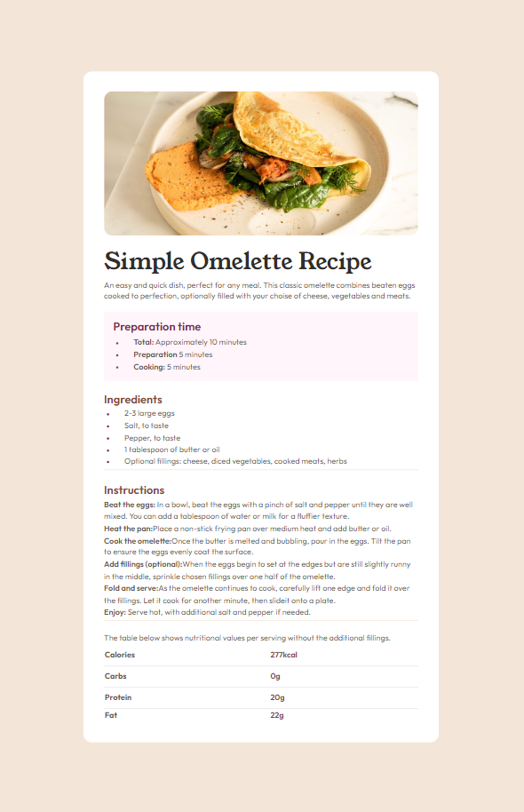

# Frontend Mentor - QR code component solution

Hi, Niels here.
This is a solution to the [Recipe page challenge on Frontend Mentor](https://www.frontendmentor.io/challenges/recipe-page-KiTsR8QQKm). [Hosted on GH Pages](https://nielsfechtel.github.io/frontendmentor_1_recipe/).

## Table of contents

- [Frontend Mentor - QR code component solution](#frontend-mentor---qr-code-component-solution)
  - [Table of contents](#table-of-contents)
  - [Overview](#overview)
    - [Screenshot](#screenshot)
    - [What I learned](#what-i-learned)
  - [Author](#author)

## Overview

### Screenshot



### What I learned

I had a difficult time with getting content to not overflow, especially the image and all the content on the smallest of viewport-sizes, like the Galaxy 9+-preset in the Dev Tools. That's why I added these media queries. On very small devices, the second query's content would cause overflowing and disappearing content. The third query is for weirdly landscape-devices, where content was also overflowing otherwise. I didn't add max-content to the general main-height because that didn't work with max(), clamp() etc? Clearly I don't completely understand the workflow here, yet.


```css
@media screen and (width < 600px) {
  main {
    width: 100%;
    height: 100%;
  }
}

@media screen and (width > 600px) {
  html,
  body {
    height: 100%;
  }
}

/* For landscape-devices like the iPad Pro. See note in Readme.md */
@media screen and (height < 1200px) and (width > 600px) {
  main {
    height: max-content;
  }
}
```

## Author

- Website - [Niels Fechtel](https://niels-fechtel.com)
